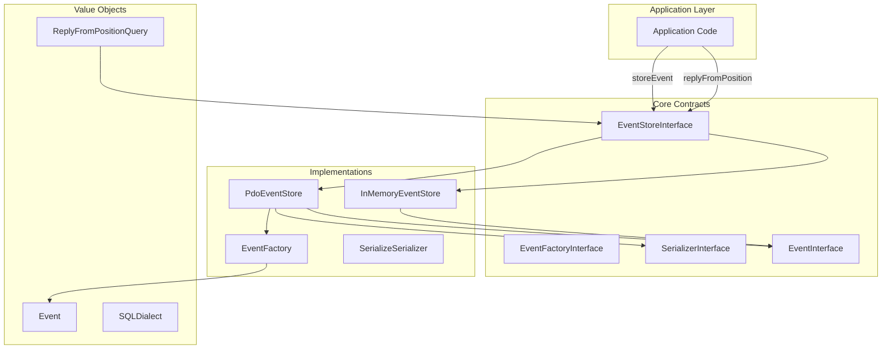
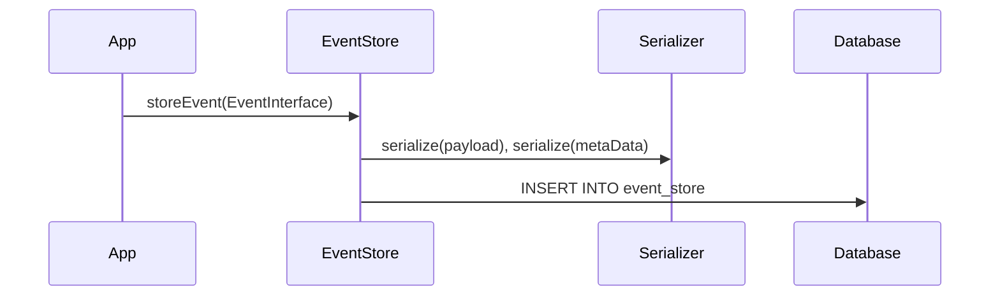
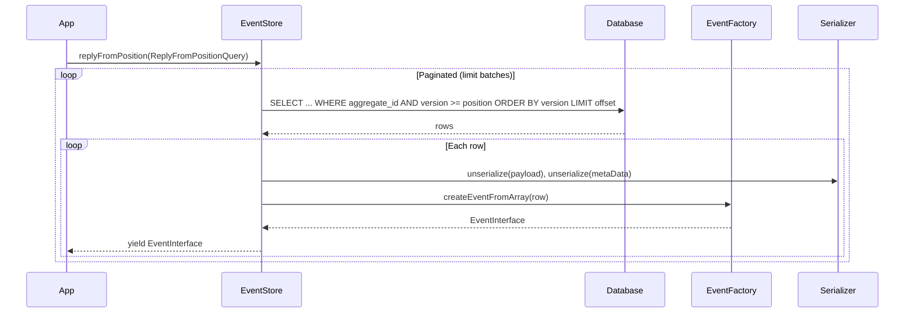

# Event Store Architecture

The **phauthentic/event-store** is a PHP library providing an event sourcing abstraction. It stores domain events and allows replaying them by aggregate from a given version position. The design follows interface-based abstractions with pluggable storage backends and serialization.

## Architecture Diagram

## Data Flow

### Store Event

### Replay From Position

## Component Breakdown

### Core Interfaces

| Component | Purpose |
|-----------|---------|
| EventStoreInterface | Main contract: `storeEvent()` and `replyFromPosition()` returning an `Iterator` |
| EventInterface | DTO contract for stored events (aggregateId, version, event name, payload, createdAt, correlationId, metaData) |
| EventFactoryInterface | Creates `EventInterface` from array (used when hydrating from storage) |
| SerializerInterface | Serializes/unserializes payload and metadata for persistence |

### Implementations

| Component | Purpose |
|-----------|---------|
| PdoEventStore | SQL-backed store (MySQL, MariaDB, PostgreSQL, SQLite, MS SQL). Uses SerializerInterface for payload/metaData, EventFactoryInterface for hydration. Supports SQLDialect for MS SQL OFFSET/FETCH syntax. |
| InMemoryEventStore | In-memory store for testing. Validates version > 0 and rejects duplicate versions per aggregate. |
| EventFactory | Validates required keys, applies defaults (stream, correlationId, metaData), parses CREATED_AT from string. |
| SerializeSerializer | PHP serialize/unserialize with allowed_classes=true. See security warning for untrusted input. |

### Value Objects

| Component | Purpose |
|-----------|---------|
| Event | Immutable DTO implementing EventInterface |
| ReplyFromPositionQuery | Readonly query object: aggregateId + position (1-based). Validates position > 0. |
| SQLDialect | Enum: Standard (MySQL/PostgreSQL/SQLite) vs MSSQL for OFFSET/FETCH syntax |

## Database Schema

Single table `event_store` with:

- `id` (auto-increment)
- `stream`, `aggregate_id`, `version`, `event`, `payload`, `created_at`, `correlation_id`, `meta_data`
- Unique constraint on `(aggregate_id, version)` to enforce optimistic concurrency
- Composite index on `(aggregate_id, version)` for replay queries
